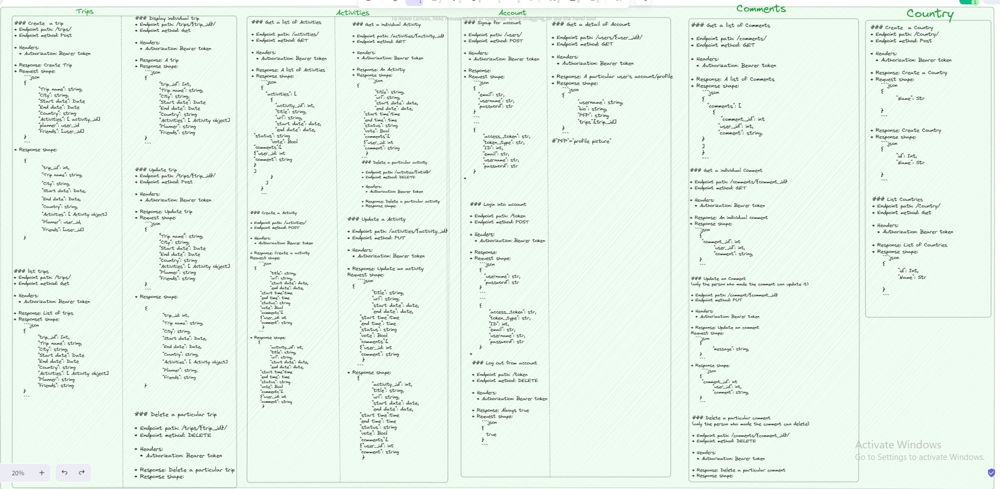
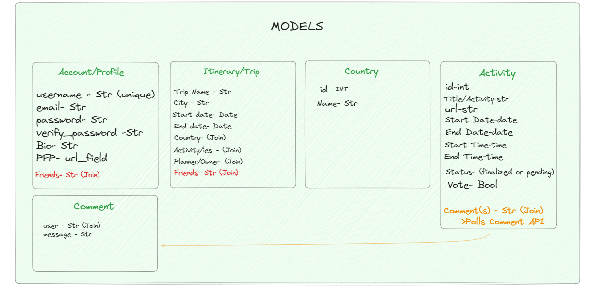

Project URLS:

  Backend Deployment:
    https://jun-8-pt-voyamieapi.mod3projects.com/docs#/

  Frontend Deployment:
    https://vacationeers.gitlab.io/voy-amie

  Gitlab:
    https://gitlab.com/vacationeers/voy-amie

Members:

  Abraham Gebreselassie: Trips Page, Trips API, Friends API
  Hector Elias: Create Trip Page, Comments API
  Juan Chavez: Trip Final Page, Country API, Participants API
  Miguel Ortiz: Profile Page, Activities API, Participants API

Description:

  Have you ever tried organizing a trip with a friend or multiple friends? If you have, then you will understand the headache that comes with trying to get everything organized and planned. Luckily Voy-Amie is here to assist you; Users of Voy-Amie can create a trip, add friends and vote to decide what activities to partake in.

  When a user creates a trip, they have the ability to give it a name, select the destination and select the time and dates. After, the creator of the trip can add friends to be able to begin coordinating. Users can then begin to suggest trip activities to partake in, this would include the activity title, location of the activity as well as the date and the time.

  Once the trip has been created and activities have been suggested, users that are part of the trip have the ability to vote on the activities, with a simple majority a trip is approved and sent to the final itinerary that displays all the finalized activities that can be sorted by date.

How to Run on Local Device:

  1. Open your terminal and CD into your desired directory
  2. Clone repository grab link and type the following command into your terminal "Git clone https://gitlab.com/vacationeers/voy-amie.git"
  3. CD into Voy-Amie
  4. Install Docker through the following Commands
      docker volume create postgres-data
      docker volume create beta-data
      docker-compose build
      docker-compose up
  5. With Docker up and running, in your browser go to http://localhost:8000/docs to view the FastAPI backend endpoints
  6. With Docker up and running, in your browser go to http://localhost:3000 to view the project, navigate using the navbar

Design:

  Voy-Amie's Backend is build on FastAPI and a PostreSQL Database, the Front end consists of React and JSX for stylization.
## Design

## Service Microservice

Voy-Amie Overview:
  The following Files and Folders are available within the Voy-Amie project.

    -Requirements.txt:
      A file that tells the Dockerfile what it needs to install on boot.

    -Main.py:
      Connects the FastAPI system to our routers.

    -Dockerfile:
      Allows the docker system to load and run all required information as well as run the systems through appropriate ports.

    -Migrations:
      Within this folder lies 002_table_migrations.py that allows us to determine and store all of our objects and tables into the database.

    -Queries:
      This file is the location of the pydantic models for our objects. A file is dedicated to each of our objects.

    -Routers:
      Allows us to route the paths of our objects we want to create to communicate with the database.
      Router files and Queries files work together to make sure information is being stored and sent back and forth when called.
