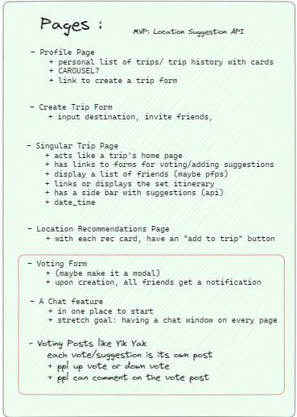

Project URLS:

Backend Deployment:
https://jun-8-pt-voyamieapi.mod3projects.com/docs#/

Frontend Deployment:
https://vacationeers.gitlab.io/voy-amie

Gitlab:
https://gitlab.com/vacationeers/voy-amie

Members:

Abraham Gebreselassie: Trips Detail Page, Trips API, Friends API
Hector Elias: Create Trip Form Page, Make Participant Page, Add Friends Page, Comments API
Juan Chavez: Trip Final Page, Country API, Participants API,
Miguel Ortiz: Profile Page, Activities API, Participants API

Description:

Have you ever tried organizing a trip with a friend or multiple friends? If you have, then you will understand the headache that comes with trying to get everything organized and planned. Luckily Voy-Amie is here to assist you; Users of Voy-Amie can create a trip, add friends and vote to decide what activities to partake in.

When a user creates a trip, they have the ability to give it a name, select the destination and select the time and dates. After, the creator of the trip can add friends to be able to begin coordinating. Users can then begin to suggest trip activities to partake in, this would include the activity title, location of the activity as well as the date and the time.

Once the trip has been created and activities have been suggested, users that are part of the trip have the ability to vote on the activities, with a simple majority a trip is approved and sent to the final itinerary that displays all the finalized activities that can be sorted by date.

How to Run on Local Device:

1. Open your terminal and CD into your desired directory
2. Clone repository grab link and type the following command into your terminal "Git clone https://gitlab.com/vacationeers/voy-amie.git"
3. CD into Voy-Amie
4. Install Docker through the following Commands
   docker volume create postgres-data
   docker volume create beta-data
   docker-compose build
   docker-compose up
5. With Docker up and running, in your browser go to http://localhost:8000/docs to view the FastAPI backend endpoints
6. With Docker up and running, in your browser go to http://localhost:3000 to view the project, navigate using the navbar

Design:

Voy-Amie's Backend is build on FastAPI and a PostreSQL Database, the Front end consists of React and JSX for stylization.

## Design

## Service Microservice

Voy-Amie Overview:
The following Files and Folders are available within the Voy-Amie project.

    -Requirements.txt:
      A file that tells the Dockerfile what it needs to install on boot.

    -Main.py:
      Connects the FastAPI system to our routers.

    -Dockerfile:
      Allows the docker system to load and run all required information as well as run the systems through appropriate ports.

    -Migrations:
      Within this folder lies 002_table_migrations.py that allows us to determine and store all of our objects and tables into the database.

    -Queries:
      This file is the location of the pydantic models for our objects. A file is dedicated to each of our objects.

    -Routers:
      Allows us to route the paths of our objects we want to create to communicate with the database.
      Router files and Queries files work together to make sure information is being stored and sent back and forth when called.

<h3>Juans Readme:</h3>

On the back end I was tasked with creating the countries table, queries and router that allows us to create/delete/get a country were the trips will take place. I also assisted in building the endpoints for the participants as well as helped with the backend Auth and I also build the Readme infrastructure and built a UnitTest

On the frontend I Was tasked with creating the Final Trips page / Itinerary that displayed the activities that had been voted on approved and finalized. On this page the information of the approved/finalized trips can be seen as well as filtered by date. This page is Authorize protected to only allow the people who are participants of a trip to be able to see this page, if you are not a participant a message will appear informing you that you are not able to see the information. On a smaller scale I also assisted with the Trip Detail pages authorization, the Sign up page Navigation allowing the user to navigate to the profile upon completing a trips form, the Home Page and updated the navbar.

## Frontend Description

- Create Trip:
  In this page, the logged in user is able to input data into a form to create a trip. The data they input is Trip Name, the Destination's City and Country (a dropdown selection), and Start and End dates for the trip. Once filled out, the user clicks on the submission button and is guided back to their profile page. They will be able to see the trip they just created in the Trips List with its information.

- Make Participant:
  This page is only accessible to a trip's planner. The planner will be able to see a button in the Trip's Detail page that upon click will direct them to the page where they will be shown a list of their friends and a list of existing trip participants. The friends list will only show friends that are not yet participants to the current trip with a button on each friend row that upon clicking will make them a participant. This functionality will dynamically remove them from the friends list, then add them to the Participants list below. A similar functionality happens when the button next ot a participant's name is clicked. It removes them as a participant and they are again displayed on the friends list.

  - Add Friends Page:
    This feature's page is accessible by clicking the 'Add Friend' button on any logged in user's profile page. This directs them to the page that displays a search bar. The user is to type in the username of a fellow existing user that they want to befriend. The dynamic search bar starts to populate a list of users whose username includes what the current user is typing within the search bar.

- Trip Detail Page:
  This page shows the details of a page that a user has created and can add their friends as participants. This page has authorization in that only the planner or the participants the planner has added to a particular trip.

  A feature of this page include a form to allow authorized users to add activities to a trip allowing for a title, a url link to the activity give more details of an activity, the time and date for the activity.

  This page includes a second form to allow authorize users to add comments about the trip or a particular activity.

  There are tables to display all of the activities that have been attached to a trip, with also a vote count, and a vote button that allows for users to vote on an activity. Also, with the vote count if it is 50% or greater than 50% of the number of participants the status of the activity changes from "PENDING" to "FINALIZED". Once a trip changes from the "PENDING" status it is removed from the table.

  There is also a table to display the comments that have been made on a trip displaying the commenter which would be the user that made the comment and also what they chose to comment on.

  There is also a table that is titled Participants which shows the usernames of all the participants that have been added to this trip.

  There is a button that allows is a link to the participants page which allows a user to add their friends to be participants of a trip, the trip being the one they previously visited on in the trip detail page.

  Lastly, there is a button that also functions as a link to the TripFinalized page, which only displays the activities with the status of "FINALIZED".

### Miguel's Backend and Frontend Contribution

- Profile Frontend: When someone signs up or logs in, they are redirected to the profile page. If the user has given a url link for their profile picture, it will render an image once they input it. The Bio is in a text box where the user can write anything they want to add and save those updates. The profile page also pulls data and gets it listed when a trip is created. The following work was completed by the rest of the team. The trip name has a link where it redirects the user to that trip where they can create activities associated to that trip, voting can be done on those activities and also place comments. Once the votes and have reached a 50% threshold, it gets added to the finalized trip page.

Activities BackEnd Endpoints:
These are the endpoints that were created for the "/activities" endpoint.

    -"/activities" 'POST' this endpoint is what is creating a activity, where the it's associated to a trip.

{
"trip": 1,
"title": "Going to Vegas",
"url": "vegas.com",
"date": "10/27/2023",
"time": "string",
"status": "string",
"vote": 0
}

    -"/activities" 'GET' this endpoint gets all of the activities

[
{
"activity_id": 1,
"trip": 1,
"title": "Going to the beach",
"url": "la.com",
"date": "10/26/2023",
"time": "7:00 pm",
"status": "FINALIZED",
"vote": 1
}
]

    -"/activities/{activity_id}" 'GET' this endpoint allows a user to get an individual activity based on the activity_id

{
"activity_id": 1,
"trip": 1,
"title": "Going to the beach",
"url": "la.com",
"date": "10/26/2023",
"time": "7:00 pm",
"status": "FINALIZED",
"vote": 1
}

    -"activities/{activity_id}" 'PUT' allows a user to update an activity based on the activity_id

{
"activity_id": 1,
"trip": 1,
"title": "Going to the beach",
"url": "la.com",
"date": "10/26/2023",
"time": "6:00 pm",
"status": "FINALIZED",
"vote": 1
}

